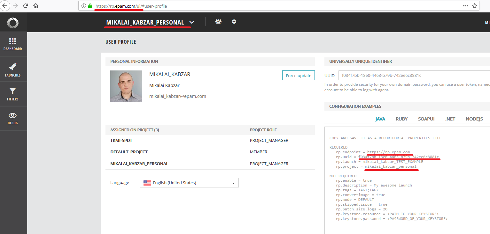
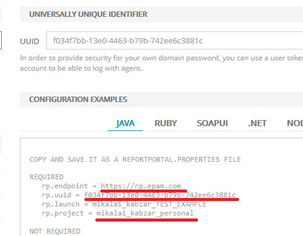
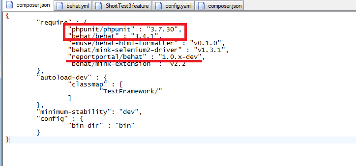
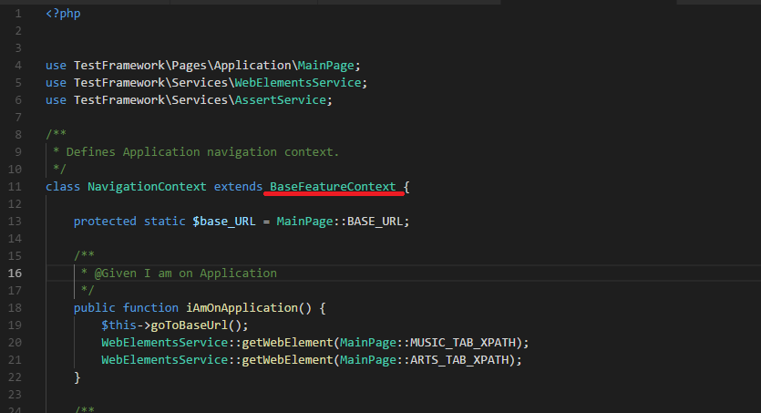
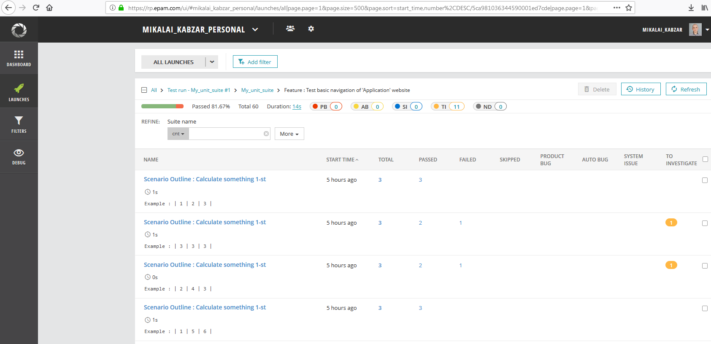

# Reporting with Report Portal agent for the Behat framework.

## Preconditions
1) Behat framework.
2) Report Portal (RP) instance.

## Steps

### 1) Create in the Behat-based test framework's root folder ‘config.yaml’ file with next fields:
UUID – your own access key. 

Host – RP instance address.

projectName – name of project to create launches.

timeZone – your time zone.

### 2) Update composer.json file of your framework with "reportportal/behat" : "1.0.x-dev", dependency.

Note: "reportportal/behat" : "1.0.x-dev", was tested for behat 3.4.1 and phpunit 3.7.30.

### 3) Open terminal in the root folder and execute “composer update” command.

### 4) Update/create your "base feature context" class with next dependencies.

Note: BaseFeatureContext is a class that extends RawMinkContext class and implements Comtext and SnippetAcceptingContext interfaces. You can't create a Behat-based framework without this class.

    use BehatReportPortal\BehatReportPortalAnnotations;
    use BehatReportPortal\BehatReportPortalService;
    use ReportPortalBasic\Service\ReportPortalHTTPService;

The base feature context class should implement BehatReportPortalAnnotations.

### 5) Implement BehatReportPortalAnnotations’ methods in the basic context class (BaseFeatureContext on the picture above).

    public static function startLaunch(HookScope $event)
    public static function startFeature(HookScope $event)
    public static function startScenario(HookScope $event)
    public static function startStep(HookScope $event)
    public static function finishStep(HookScope $event)
    public static function finishScenario(HookScope $event)
    public static function finishFeature(HookScope $event)
    public static function finishLaunch(HookScope $event)
    
    public static function startLaunch(HookScope $event)
    {
        if (!ReportPortalHTTPService::isSuiteRunned()) {
            ReportPortalHTTPService::configureReportPortalHTTPService('config.yaml');
            BehatReportPortalService::startLaunch($event);
        }
    }

    public static function startFeature(HookScope $event)
    {
        if (!ReportPortalHTTPService::isFeatureRunned()) {
            BehatReportPortalService::startFeature($event);
        }
    }

    public static function startScenario(HookScope $event)
    {
        if (!ReportPortalHTTPService::isScenarioRunned()) {
            BehatReportPortalService::startScenario($event);
        }
    }

    public static function startStep(HookScope $event)
    {
        if (!ReportPortalHTTPService::isStepRunned()) {
            BehatReportPortalService::startStep($event);
        }
    }

    public static function finishStep(HookScope $event)
    {

        if (ReportPortalHTTPService::isStepRunned()) {
            $pictureAsString = '';
            if ($event->getTestResult()->getResultCode() === TestResult::FAILED) {
                $session = Service::getSession();
                if ($session != null) {
                    $pictureAsString = $session->getDriver()->getScreenshot();
                }
            }
            BehatReportPortalService::finishStep($event, $pictureAsString);
        }
    }

    public static function finishScenario(HookScope $event)
    {
        if (ReportPortalHTTPService::isScenarioRunned()) {
            Service::sessionToNull();
            BehatReportPortalService::finishScenario($event);
        }
    }

    public static function finishFeature(HookScope $event)
    {
        if (ReportPortalHTTPService::isFeatureRunned()) {
            BehatReportPortalService::finishFeature($event);
        }
    }

    public static function finishLaunch(HookScope $event)
    {
        if (ReportPortalHTTPService::isSuiteRunned()) {
            BehatReportPortalService::finishLaunch($event);
        }
    }

### 6) Each feature context class should extend BaseFeatureContext class that implements BehatReportPortalAnnotations interface and methods.

### 7) Run auto-tests to check RP integration.

